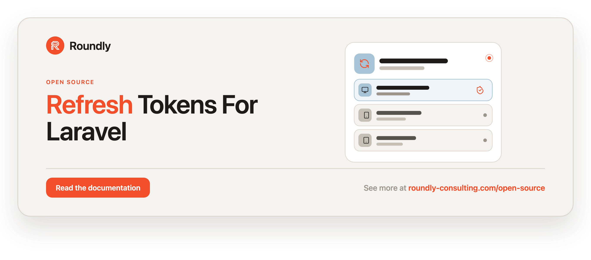

<p align="center">
  <a href="https://roundly-consulting.com/open-source">
    
  </a>
</p>

# Refresh Tokens for Laravel

Opaque, rotating **refresh tokens** and **device sessions** for Laravel — SHA-256 at rest,
atomic single-query anti-double-spend rotation, always-on family revocation on reuse
detection, and first-class session management. **Zero third-party runtime dependencies.**

This package owns the full lifecycle of refresh tokens and sessions. It deliberately stays
out of concerns the host already owns: JWT minting/verification and jti denylisting, user-agent
parsing, IP geolocation, HTTP routes/controllers, and cookie transport. Those plug in through a
small contract and DTO inputs.

## Requirements

- PHP 8.4+
- Laravel 12 or 13

## Integrates with

- **[crypto-for-laravel](https://github.com/roundly-consulting/crypto-for-laravel)** — the at-rest
  digest (`Crypto\Hash\Digest`, plain or HMAC-peppered) and the CSPRNG plaintext
  (`Crypto\Random\Token`) come from the shared, audited crypto package, so the token store and the
  entropy floor are maintained in one place instead of re-implemented here. Installed automatically;
  nothing to configure — this package still owns `config/refresh-tokens.php` and hands the
  algorithm, length, and pepper to crypto at the boundary.
- **[enums-for-laravel](https://github.com/roundly-consulting/enums-for-laravel)** — labels and
  select options on `RevocationReason` and `DeviceType`.
- **[package-toolkit-for-laravel](https://github.com/roundly-consulting/package-toolkit-for-laravel)**
  — the service provider, the `key_type` → column mapping (`KeyType` + the `ownerKey()` schema macro),
  the model resolver behind `refresh-tokens.model`, and the `php artisan about` section. Installed
  automatically; nothing to configure.

## Installation

```bash
composer require roundly-consulting/refresh-tokens-for-laravel
```

**Migrations are publish-only** — the package does not load them, so publish first, then migrate.
If your users are UUID/ULID-keyed, publish the config and set `key_type` **before** you migrate (the
owner column is baked into the schema):

```bash
php artisan vendor:publish --tag="refresh-tokens-migrations"
php artisan migrate
```

Optionally publish the config file:

```bash
php artisan vendor:publish --tag="refresh-tokens-config"
```

Add the trait to your user model to expose its tokens and sessions:

```php
use RoundlyConsulting\RefreshTokens\Traits\HasRefreshTokens;

final class User extends Authenticatable
{
    use HasRefreshTokens;
}
```

## Configuration

The published `config/refresh-tokens.php`:

| Key | Type | Default | Env | Purpose |
|---|---|---|---|---|
| `table` | string | `refresh_tokens` | `REFRESH_TOKENS_TABLE` | Table name. |
| `model` | class-string | `RefreshToken::class` | — | Model class; swap for a host subclass. |
| `user_model` | class-string | `App\Models\User` | `REFRESH_TOKENS_USER_MODEL` | Owner model for the relation. |
| `foreign_key` | string | `user_id` | `REFRESH_TOKENS_FOREIGN_KEY` | Owner foreign key. |
| `key_type` | string | `bigint` | `REFRESH_TOKENS_KEY_TYPE` | Owner primary-key type driving the FK column: `bigint` (alias: `id`), `uuid`, or `ulid`. An unrecognized value falls back to `bigint`. |
| `ttl` | int (seconds) | `2592000` (30 days) | `REFRESH_TOKENS_TTL` | Sliding token lifetime per issue/rotation. |
| `absolute_ttl` | int (seconds) | `7776000` (90 days) | `REFRESH_TOKENS_ABSOLUTE_TTL` | Absolute cap on a rotation chain measured from the family root. `0` disables. |
| `token_length` | int | `64` | `REFRESH_TOKENS_LENGTH` | Plaintext length in base64url chars (~384 bits at 64). Minimum `32`, maximum `4096` — outside it throws. |
| `hash.algo` | string | `sha256` | `REFRESH_TOKENS_HASH_ALGO` | At-rest hash algorithm; allowlisted to `sha256`, `sha384`, `sha512`. |
| `hash.key` | ?string | `null` | `REFRESH_TOKENS_HASH_KEY` | Optional HMAC pepper; null = plain hash. |
| `rotation.grace` | int (seconds) | `0` | `REFRESH_TOKENS_ROTATION_GRACE` | Benign single-flight window before a re-presented token counts as reuse. `0` = strict. |
| `prune.after` | int (days) | `30` | `REFRESH_TOKENS_PRUNE_AFTER` | Retention past revoke/expiry before pruning. Floored at `1` day. |

The package works with **zero** configuration — every key has a sensible env-backed default.

Inspect the live configuration with:

```bash
php artisan about --only=refresh-tokens
```

The section is **secret-safe**: the pepper reports as `SET`/`MISSING` and never as a value, and a
renamed table or a bound revoker reports as `CUSTOM`/`BOUND` — nothing a support screenshot could
leak.

### Validated configuration (fail loud, not silent)

Two security-relevant keys are validated rather than silently coerced, so an env typo can't
degrade the token store:

- **`hash.algo`** is restricted to the SHA-2 allowlist (`sha256`, `sha384`, `sha512`). Any other
  value (`md5`, `crc32b`, …) throws `InvalidTokenConfigurationException`. All three allowed digests
  fit the `token_hash` column (widened to 128 chars for `sha512`).
- **`token_length`** enforces a floor of **32** characters; a shorter value throws
  `InvalidTokenConfigurationException` instead of minting a brute-forceable token.

### Owner key type (UUID / ULID user models)

The foreign-key column matches your user model's primary key. Set `key_type` **before the first
migration** to `uuid` or `ulid` for non-integer user keys; the default `bigint` creates the usual
auto-incrementing column. `id` is accepted as an alias for `bigint`.

Unlike the two keys above, an **unrecognized `key_type` does not throw** — it falls back to
`bigint`. Schema shape is not a security boundary, and a one-line env typo must never leave a host
unable to migrate.

```dotenv
REFRESH_TOKENS_KEY_TYPE=ulid
```

### Absolute session lifetime

Every rotation issues the replacement with a fresh sliding `ttl`, so a continuously refreshed
session could otherwise live forever. `absolute_ttl` caps the whole rotation chain: the
replacement's expiry is `min(now + ttl, family_root.created_at + absolute_ttl)`. Set it to `0` to
disable the cap and fall back to pure sliding expiry.

### Serialization safety

The `RefreshToken` model hides `token_hash` and `access_reference` from array/JSON output
(`$hidden`), so a "your devices" endpoint that serializes session rows never leaks the at-rest
digest or the access-token reference. Auth logic reads the raw attributes directly, so nothing
internal is affected.

### Why SHA-256 (not bcrypt/argon)?

A refresh token is a 64-char CSPRNG secret drawn from the base64url alphabet — ~384 bits of
entropy. A slow password hash adds nothing against a secret that can't be brute-forced and would
break the indexed unique-equality lookup rotation relies on. Set `hash.key` to layer an HMAC pepper
on top for defence-in-depth if a database dump leaks.

### Pepper (defence-in-depth)

By default tokens are stored as a plain SHA-256 digest. Set `hash.key` (env
`REFRESH_TOKENS_HASH_KEY`) to a high-entropy secret and the at-rest digest becomes
`hash_hmac('sha256', $plain, $key)` instead — a single deterministic value under the same unique
index, so the lookup and the atomic-claim mutex are unchanged. What it buys you: an attacker who
exfiltrates the database table but **not** the application secret cannot verify or brute-force any
token, even a weak one.

```dotenv
REFRESH_TOKENS_HASH_KEY=base64:your-high-entropy-secret
```

Keep the pepper outside the database (env / secrets manager) and treat it like `APP_KEY`. A
missing or whitespace-only value means "no pepper" (plain SHA-256).

**Caveat — changing `hash.key` invalidates existing tokens.** The pepper participates in the
digest, so setting, rotating, or clearing it makes every previously stored digest stop matching;
holders must re-authenticate. This is expected. The package does **not** ship online pepper
rotation (accepting old and new peppers at once) — pick a pepper up front, or plan a re-login
window when you change it.

## Usage

All examples use the `RefreshToken` facade
(`RoundlyConsulting\RefreshTokens\Facades\RefreshToken`).

### Issue

The host mints its access token **first**, then issues the refresh token linked to it. The
plaintext is returned **once** — never stored:

```php
use RoundlyConsulting\RefreshTokens\Facades\RefreshToken;
use RoundlyConsulting\RefreshTokens\DataTransferObjects\IssueContext;

$new = RefreshToken::issue($user, new IssueContext(
    ipAddress: $request->ip(),
    userAgent: $request->userAgent(),
    accessReference: $access->jti, // opaque link to the host's access token
));

$plainText = $new->plainText;      // return to the client ONCE
```

Or the fluent builder:

```php
$new = RefreshToken::for($user)
    ->fromRequest($request)        // fills ip + user agent
    ->linkedTo($access->jti)
    ->issue();
```

### Rotate

`redeem()` atomically claims and rotates a token. Of N concurrent redemptions of the same
token, exactly one wins; every failure mode collapses to `null`:

```php
$result = RefreshToken::redeem($plainFromClient); // ?RedemptionResult
if ($result === null) {
    // unknown / expired / revoked / race-lost / reuse — host maps to its own error
    throw ValidationException::withMessages([...]);
}

$user = $result->user;
$familyId = $result->familyId;
```

`rotate()` does redeem + issue a same-family replacement in one call (mint the new access token
first, pass its reference):

```php
$rotation = RefreshToken::rotate($plainFromClient, linkedTo: $newAccess->jti);
// ?RotationResult { user, newRefreshToken (NewRefreshToken), redeemedFamilyId }
```

**Failure semantics — treat `null` (or an exception) as "re-authenticate".** `rotate()` is
redeem-then-issue: the old token is consumed **before** the replacement exists, and the operation
is deliberately not rolled back on failure (un-claiming a consumed token would reopen the
double-spend window). So if the replacement can't be minted — a DB blip between redeem and issue,
the owner deleted mid-rotation, or the family being killed by a concurrent reuse response — the
call returns `null` (or throws). The client then simply holds no valid refresh token and must log
in again. This is an availability-only edge (forced re-login); no token is ever forged.

Passing an explicit `familyId` (via `IssueContext` or `->inFamily()`) is validated: the family
must already exist for **that same owner** and must not have been killed by reuse detection, or an
`InvalidTokenFamilyException` is thrown. This prevents grafting a token into another user's — or a
dead — lineage. Normal `rotate()` inherits the redeemed token's own family, so you rarely set this
by hand.

### Reuse detection

Presenting an already-rotated token is a theft signal. The **entire token family** is revoked,
the host callback is invoked for every live member's access token, and a
`RefreshTokenReuseDetected` event fires — all automatically, no config switch. The family revoke
re-scans until a pass revokes nothing, and a replacement issued into a family around the moment it
is killed self-revokes, so a freshly rotated token can never survive the theft response (either
race ordering). Tune `rotation.grace` if your frontend legitimately re-presents a token within a
short single-flight window.

The `RefreshTokenReuseDetected` event fires **only when the sweep actually revokes something**
(`revokedCount > 0`), so replaying one already-dead token can't spam your alerting with empty
events. **Request throttling stays host-owned** — the package does not rate-limit token
presentation; wrap your refresh endpoint in Laravel's throttle middleware to blunt replay floods.

### Revoke / logout

```php
RefreshToken::revoke($plainFromClient);  // logout with token in hand (idempotent)
RefreshToken::revokeAllFor($user);       // global logout — returns count revoked
```

### Sessions

A session is an active refresh-token row. The `current` flag is derived by the host by
comparing the request's access reference to each row's `access_reference`.

```php
$sessions = RefreshToken::listFor($user);                 // active, newest first
RefreshToken::revokeOthers($user, $currentAccess->jti);   // keep current, revoke the rest
RefreshToken::revokeAll($user);                           // revoke every session

// On the user model via the trait:
$user->refreshTokens();  // HasMany, all tokens
$user->sessions();       // HasMany, active tokens only
```

The trait also adds `$user->…()` verbs that read as the user acting on itself:

```php
use RoundlyConsulting\RefreshTokens\DataTransferObjects\IssueContext;

$new = $user->issueRefreshToken(new IssueContext(accessReference: $access->jti));
$user->revokeAllSessions();                 // = RefreshToken::revokeAllFor($user); returns count
$user->revokeOtherSessions($currentAccess->jti); // keep current, revoke the rest; returns count
```

### Log out everywhere on a password change

The canonical reaction to a credential change is to revoke every session. Wire it from your
change-password flow, or from a model observer when the password attribute is dirty — the package
ships the verb but never hooks your User model for you:

```php
// In a change-password action:
$user->update(['password' => Hash::make($newPassword)]);
$user->revokeAllSessions();

// …or via a saved observer:
User::saved(function (User $user): void {
    if ($user->wasChanged('password')) {
        $user->revokeAllSessions();
    }
});
```

### Binding the access-token revoker

By default the package ships a no-op `AccessTokenRevoker`, so it works standalone. Bind your own
adapter to deny access tokens (e.g. a JWT jti denylist) when a session or family is revoked:

```php
use RoundlyConsulting\RefreshTokens\Contracts\AccessTokenRevoker;

$this->app->singleton(AccessTokenRevoker::class, DenylistAccessTokenRevoker::class);

final class DenylistAccessTokenRevoker implements AccessTokenRevoker
{
    public function revoke(#[\SensitiveParameter] string $accessReference): void
    {
        // e.g. add $accessReference to your jwt jti denylist until its TTL expires
    }
}
```

### Enriching a session (device + geo)

The package never parses a user agent or geolocates an IP — the host supplies already-parsed
data, typically from an async job hooked to the `RefreshTokenIssued` event:

```php
use RoundlyConsulting\RefreshTokens\DataTransferObjects\DeviceData;
use RoundlyConsulting\RefreshTokens\DataTransferObjects\LocationData;
use RoundlyConsulting\RefreshTokens\Enums\DeviceType;

// Pass the RefreshToken model you already hold, or its id:
RefreshToken::enrich($new->token,
    new DeviceData(browser: 'Firefox', os: 'Linux', deviceType: DeviceType::Desktop, isBot: false),
    new LocationData(country: 'Slovakia', city: 'Bratislava', countryCode: 'SK', ipAddress: '203.0.113.9'),
);
```

`enrich()` accepts the `RefreshToken` model, an int, or a string key. **Write semantics:** it only
ever touches device/geo columns — never the auth columns. The six device columns are **always
overwritten** (an absent `DeviceData` field nulls its column), while the location columns are
written **only when a `LocationData` is supplied** — so a later device-only enrich never clobbers
previously stored geo.

### Events

Hook these on the host side; they carry ids/scalars only (never the model or plaintext):

- `RefreshTokenIssued(int|string $tokenId)` — trigger async device/geo enrichment.
- `RefreshTokenRedeemed(int|string $tokenId, string $familyId, int|string $userId)` — a token was
  legitimately spent (rotated); hook it to audit rotations or meter session churn.
- `SessionRevoked(int|string $tokenId, ?string $accessReference)`.
- `RefreshTokenReuseDetected(string $familyId, int|string $userId, int $revokedCount)` — theft
  signal for alerting; `revokedCount` reports how many live family members were revoked in
  response.

`rotate()` fires one `RefreshTokenRedeemed` (for the spent token) **and** one `RefreshTokenIssued`
(for the replacement).

### Pruning

Dead rows (revoked/expired past `prune.after`) are force-deleted by the command or
`model:prune`. The package does **not** self-schedule — the host schedules it:

```php
// bootstrap/app.php or a scheduler
$schedule->command('refresh-tokens:prune')->daily();
```

```bash
php artisan refresh-tokens:prune            # uses config('refresh-tokens.prune.after')
php artisan refresh-tokens:prune --days=7   # override retention
```

`--days` is floored at **1** (a value of `0` or a non-integer is rejected). Pruning tokens revoked
less than a day ago would destroy **reuse-detection evidence**: a rotated token pruned minutes
after revocation, then re-presented by a thief, finds no row and fires no family revoke. Keep the
retention window comfortably longer than your access-token TTL so the theft signal survives.

## Security

- **SHA-256 at rest** (allowlisted SHA-2 only) under a unique index; the plaintext is returned
  once and never persisted, and `token_hash`/`access_reference` are hidden from serialization.
- **Single-query anti-double-spend** rotation (`WHERE revoked_at IS NULL` compare-and-swap) — no
  transaction, no row lock; works identically on PostgreSQL and SQLite.
- **Always-on family revocation** on reuse detection, race-hardened so no rotated replacement
  survives the theft response and the signal never spams on replayed dead tokens.
- **Absolute session lifetime** (`absolute_ttl`) caps a rotation chain so a stolen-but-active
  session can't be refreshed forever.
- `#[SensitiveParameter]` on every plaintext parameter; plaintext and hashes are never logged.

Intentionally host-owned (not this package): JWT minting/verification, jti denylisting,
user-agent parsing, IP geolocation, HTTP routes/controllers, throttling, and cookie transport.

## Testing

Assert your access-token revocation with the shipped `FakeAccessTokenRevoker` — bind it in place
of your real revoker and assert exactly which access references the package asked to deny, no
hand-rolled spy required:

```php
use RoundlyConsulting\RefreshTokens\Contracts\AccessTokenRevoker;
use RoundlyConsulting\RefreshTokens\Testing\FakeAccessTokenRevoker;

$fake = new FakeAccessTokenRevoker();
$this->app->instance(AccessTokenRevoker::class, $fake);

// … exercise reuse detection / session revocation …

$fake->assertRevoked($jti);
$fake->assertNotRevoked($otherJti);
$fake->assertRevokedCount(2);
$fake->assertNothingRevoked();   // when nothing should have been denied
```

Its assertions throw a package exception (not a PHPUnit assertion), so it works under any runner.

Run the package's own suite with:

```bash
composer test
composer test-coverage
```

## Changelog

See [CHANGELOG.md](CHANGELOG.md).

## License

The MIT License (MIT). Copyright (c) roundly-consulting. See [LICENSE.md](LICENSE.md).
